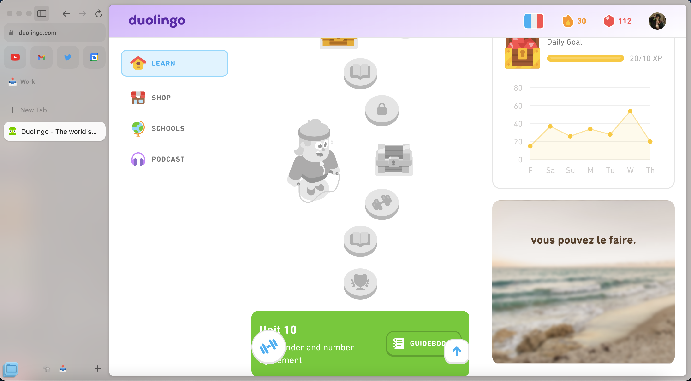

Duolingo Violet is an Arc Browser boost that removes Super Duolingo ads and adds a light visual theme.

## Installation
1. Go to the [Duolingo Learn Site](https://www.duolingo.com/learn).
2. Click on 'New Boost' in the corresponding Arc menu.
3. Click 'Custom' and 'A specific website' and 'Create Boost'.
4. Copy and paste the file contents into the corresponding files using the Arc editor.
8. Refresh the page to apply changes.

## Description of the boost
Duolingo Violet re-skins Duolingo and removes Super Duolingo ads that other blockers miss due to them being built straight into the page. Duolingo is an important part of my daily routine as I'm currently trying to learn French. I want to know more about how languages work and as a long-time Latin student and current Latin minor, I would like to add additional Romance languages to my repertoire. Because of this, I would like a Duolingo experience with as few distractions as possible. As someone who values knowledge and an ad-free web, this is a lightweight option that helps me with both endeavors.
